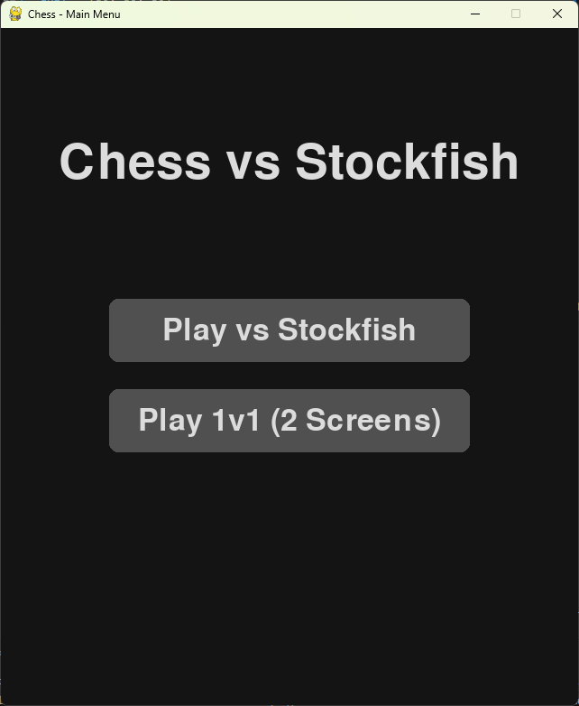
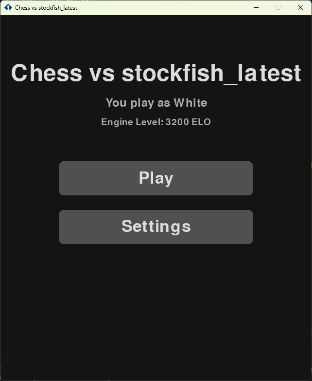
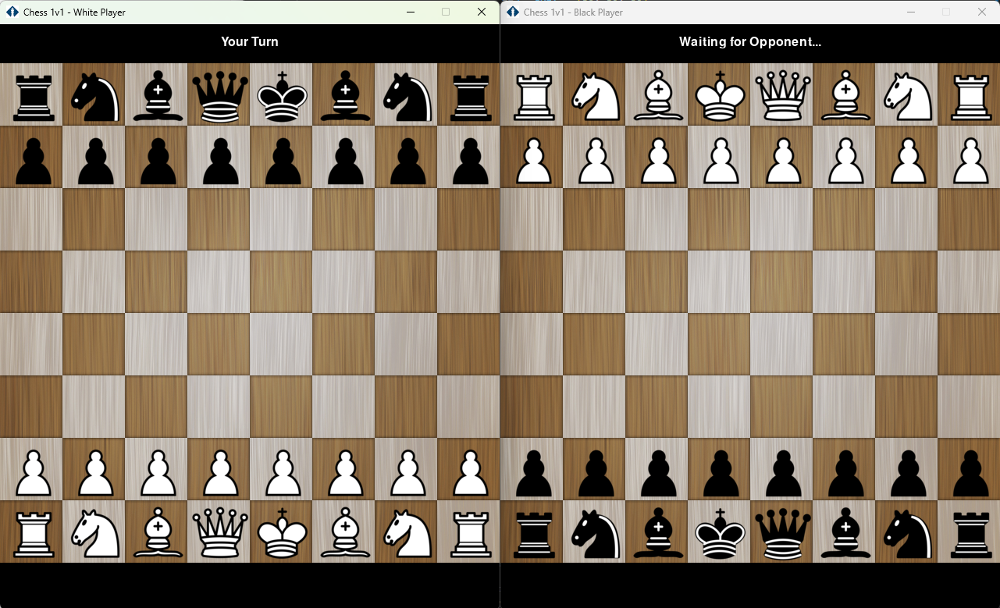

    
# ♟️ Chess vs Stockfish

<div align="center">


**Jeu d'échecs en Python avec une interface Pygame, un moteur Stockfish configurable, et un mode 1v1 innovant sur deux écrans.**

</div>

---

## 📋 Table des Matières

1. [À Propos du Projet](#à-propos-du-projet)
2. [Images](#images)
3. [Fonctionnalités Principales](#-fonctionnalités-principales)
4. [Stack Technique](#️-stack-technique)
5. [Architecture](#️-architecture)
6. [Démarrage Rapide](#-démarrage-rapide) ⭐ **COMMENCEZ ICI**
7. [Utilisation](#-utilisation)
8. [Configuration de l'IA](#️-configuration-de-lia)
9. [Structure du Projet](#-structure-du-projet)
10. [Tests et Débogage](#-tests-et-débogage)
11. [Troubleshooting](#-troubleshooting-dépannage)
12. [Guide Développeur](#-guide-développeur)
13. [Intégration Robot](#-intégration-robot-avancé)
14. [Contribuer](#-contribuer)
15. [Contact](#-contact)

---

## À Propos du Projet

**Chess vs Stockfish** est une implémentation complète du jeu d'échecs, développée en Python et destinée aux amateurs d'échecs et aux développeurs. Il se distingue par son interface soignée construite avec Pygame, son intégration robuste du moteur d'échecs de renommée mondiale **Stockfish**, et surtout, son mode multijoueur local unique.

Ce mode 1v1 lance deux instances distinctes du jeu, synchronisées par un système de communication simple, permettant une expérience de jeu sur deux écrans. Cette fonctionnalité a été initialement conçue pour des installations physiques, comme un robot échiquier contrôlé par deux tablettes.

## Images
### Main menu


### Play against Stockfish 


### 1 vs 1

## ✨ Fonctionnalités Principales

### Modes de Jeu
*   **Solo contre l'IA** : Affrontez une version configurable de Stockfish. Idéal pour s'entraîner et analyser ses parties.
*   **1v1 Local (Deux Écrans)** : Lancez deux fenêtres de jeu indépendantes. Le plateau du joueur Noir est automatiquement retourné pour une perspective optimale.

### Moteur d'Échecs et Règles
*   ✅ **Validation Complète** : Utilise `python-chess` pour une validation rigoureuse de chaque coup, incluant les mouvements spéciaux (roque, prise en passant, promotion).
*   🏆 **Détection de Fin de Partie** : Gestion automatique de l'échec et mat, du pat, de la règle des 50 coups, de la triple répétition et du matériel insuffisant.
*   ⚙️ **Moteur Configurable** : Ajustez facilement le niveau de l'IA via une interface dédiée (niveau ELO, temps de réflexion, etc.).

### Technique et Robustesse
*   🎨 **Interface Moderne** : Une interface utilisateur sombre, propre et intuitive pour tous les menus et écrans de jeu.
*   🔄 **Gestion d'Erreurs** : Le système est conçu pour être résilient, avec un mode de secours qui active une IA aléatoire si le moteur Stockfish rencontre des erreurs répétées.
*   📁 **Communication Inter-Processus** : Le mode 1v1 utilise un système de communication basé sur un fichier (`next_move.txt`) pour synchroniser l'état de la partie entre les deux instances de jeu.
*   🤖 **Intégration Robot** : Système complet de gestion automatique des captures avec détection et synchronisation entre le jeu et un robot physique d'échecs.

---

## 🛠️ Stack Technique

*   **Langage** : Python 3.12+
*   **Interface Graphique** : Pygame
*   **Logique d'Échecs** : `python-chess`
*   **Moteur d'IA** : Stockfish (géré via un gestionnaire de moteurs intégré)

---

## 🏗️ Architecture

Le projet est structuré autour d'un lanceur central qui dirige vers les différents modes de jeu.

```
                      +-----------------------+
                      |   main_stockfish.py   |
                      | (Point d'entrée)      |
                      +-----------+-----------+
                                  |
                   +--------------+--------------+
                   |                             |
         CHOIX DE MODE: PVE             CHOIX DE MODE: PVP
                   |                             |
                   |                +----------------------------+
                   |                | Lance 2 processus de       |
                   |                | game_with_stockfish.py     |
                   |                +-------------+--------------+
                   |                              |
                   | (Instance unique)            | (Client Blanc & Client Noir)
                   |                              |
                   +--------------+---------------+
                                  |
                      +-----------v-----------+
                      | game_with_stockfish.py|
                      | (Boucle de jeu, UI)   |
                      +-----------+-----------+
                                  |
                      +-----------v-----------+
                      | chess_with_validation.py|
                      | (Logique, validation) |
                      +-----------+-----------+
                                  |
           +----------------------+----------------------+
           |                      |                      |
+----------v---------+ +----------v----------+ +---------v----------+
|   python-chess     | |    next_move.txt    | |   uci_stockfish.py |
|    (Validation)    | |    (Synchro 1v1)    | | (Communication IA) |
+--------------------+ +---------------------+ +----------+---------+
                                                         |
                                             +-----------v----------+
                                             |   Stockfish Engine   |
                                             |     (exécutable)     |
                                             +----------------------+
```

    
#### Communication
*   **Mode IA (PVE)** : La communication avec le moteur Stockfish se fait via des `subprocess` qui exécutent le moteur en arrière-plan.
*   **Mode 1v1 (PVP)** : La synchronisation entre les deux fenêtres de jeu est assurée par un fichier (`next_move.txt`) agissant comme un canal de communication inter-processus (IPC) simple mais efficace.

---

## 🚀 Démarrage Rapide

### Prérequis
- **Python 3.12+** (vérifiez avec `python --version`)
- **Pip** (gestionnaire de paquets Python)
- **Git** pour cloner le dépôt

### Installation

1.  **Clonez le dépôt :**
    ```sh
    git clone https://github.com/romainbouchez/chess-vs-stockfish.git
    cd chess-vs-stockfish
    ```

2.  **Installez les dépendances :**
    ```sh
    pip install -r requirements.txt
    ```

3.  **Vérifiez l'installation :**
    ```sh
    python tests/test_stockfish.py
    ```
    ✅ **Résultat attendu :** `SUCCES: Stockfish fonctionne!`

### Premier Lancement

**Au premier lancement, Stockfish sera automatiquement téléchargé :**

1.  Lancez l'application :
    ```sh
    python main_stockfish.py
    ```

2.  Dans le menu principal, cliquez sur **"Play vs Stockfish"**

3.  Cliquez sur le bouton **"Engines"**

4.  Sélectionnez **"Stockfish latest"** et cliquez sur **"Download"**

5.  Une fois téléchargé, cliquez sur **"Play"** pour commencer votre première partie !

---

## 🎮 Utilisation

### 🤖 Mode Solo (Player vs Stockfish)

Affrontez le moteur d'échecs Stockfish avec une difficulté configurable.

**Lancement :**
```sh
python main_stockfish.py
```

**Étapes :**
1. Cliquez sur **"Play vs Stockfish"**
2. (Optionnel) Cliquez sur **"Settings"** pour ajuster la difficulté
3. Cliquez sur **"Play"** pour commencer
4. **Jouez** : Cliquez sur une pièce, puis sur la case de destination

**Raccourcis :**
- `ESC` : Quitter le jeu
- `ESPACE` : Réinitialiser la partie

---

### 👥 Mode 1v1 (Deux Écrans)

Jouez contre un autre joueur avec deux fenêtres synchronisées automatiquement.

**Lancement :**
```sh
python main_stockfish.py
```

**Étapes :**
1. Cliquez sur **"Play 1v1 (2 Screens)"**
2. Deux fenêtres s'ouvrent automatiquement :
   - **Fenêtre 1** : Joueur Blanc (vue normale)
   - **Fenêtre 2** : Joueur Noir (vue inversée)
3. Les coups sont **synchronisés automatiquement** entre les deux fenêtres via `next_move.txt`

**Cas d'usage :**
- Jouer sur deux tablettes/écrans séparés
- Intégration avec un robot échiquier physique
- Tournois avec séparation physique des joueurs

---

## ⚙️ Configuration de l'IA

La difficulté et le comportement du moteur Stockfish peuvent être ajustés directement depuis l'interface :

1.  Lancez le jeu et choisissez `Play vs Stockfish`.
2.  Cliquez sur le bouton **Settings**.
3.  Utilisez les sliders pour configurer le **niveau ELO** ou accédez aux paramètres avancés pour plus de contrôle (threads, mémoire, etc.).
4.  Le menu **Engines** vous permet de télécharger et de gérer différentes versions de Stockfish.

**Paramètres disponibles :**
- **Niveau ELO** : 1350 (Débutant) à 3200 (Grand Maître)
- **Threads** : Nombre de cœurs CPU utilisés
- **Hash Memory** : Mémoire RAM allouée au moteur
- **Time Limit** : Temps de réflexion par coup
- **Depth Limit** : Profondeur de recherche

---

## 📁 Structure du Projet

```
chess-vs-stockfish/
│
├── main_stockfish.py          # 🚀 POINT D'ENTRÉE - Lancez ce fichier
├── game_with_stockfish.py     # Boucle de jeu et interface utilisateur
├── chess_with_validation.py   # Logique d'échecs et validation des coups
│
├── piece.py                   # Classe des pièces (sprites)
├── utils.py                   # Fonctions utilitaires (souris, événements)
│
├── universal_engine.py        # Interface universelle pour moteurs d'échecs
├── uci_stockfish.py          # Communication UCI avec Stockfish
├── engine_manager.py         # Téléchargement et gestion des moteurs
│
├── settings.py               # Paramètres Stockfish (ELO mapping)
├── universal_settings.py     # Paramètres universels (multi-moteurs)
├── settings_menu.py          # Interface de configuration
├── engine_menu.py            # Interface de gestion des moteurs
│
├── tests/                    # 🧪 Tests unitaires
│   └── test_stockfish.py     # Test de communication Stockfish
│
├── tools/                    # 🔧 Outils de développement
│   ├── debug_engine.py       # Debug des paramètres moteur
│   ├── debug_move.py         # Debug de validation des coups
│   └── diagnose_engines.py   # Diagnostic des moteurs installés
│
├── G-Code_Controller/        # 🤖 Intégration robot (optionnel)
│   ├── robot_chess_controller.py
│   ├── chess_robot_integration.py
│   ├── robot_calibration.py
│   └── robot_config.ini
│
├── res/                      # 🎨 Ressources graphiques
│   ├── board.png             # Image de l'échiquier
│   ├── pieces.png            # Sprite sheet des pièces
│   └── chess_icon.png        # Icône de l'application
│
├── img/                      # 📸 Screenshots de documentation
├── engines/                  # ⚙️ Moteurs d'échecs (téléchargés)
│
├── requirements.txt          # 📦 Dépendances Python
├── .gitignore               # Configuration Git
└── README.md                # 📖 Ce fichier
```

### 📝 Fichiers Générés à l'Exécution

Ces fichiers sont créés automatiquement et ne doivent **pas** être modifiés manuellement :

- `next_move.txt` - Synchronisation IPC pour le mode 1v1
- `engine_settings.json` - Configuration actuelle du moteur
- `engines_config.json` - Registre des moteurs installés

---

## 🧪 Tests et Débogage

### Exécuter les Tests

```sh
# Test de communication Stockfish
python tests/test_stockfish.py
```

**Résultat attendu :**
```
Test de Stockfish
==============================
Chemin: engines\stockfish_latest\stockfish\...
OK: Fichier existe
Test communication UCI...
OK: Communication UCI reussie

SUCCES: Stockfish fonctionne!
```

### Outils de Débogage

```sh
# Déboguer les paramètres du moteur
python tools/debug_engine.py

# Déboguer la validation des coups
python tools/debug_move.py

# Diagnostiquer les moteurs installés
python tools/diagnose_engines.py
```

---

## ❓ Troubleshooting (Dépannage)

### Problème : "ModuleNotFoundError: No module named 'pygame'" ou 'requests'

**Cause :** Les dépendances Python ne sont pas installées.

**Solution :**
```sh
pip install -r requirements.txt
```

**Note :** Le fichier `requirements.txt` inclut maintenant :
- `pygame` - Interface graphique
- `python-chess` - Logique d'échecs
- `requests` - Téléchargement des moteurs (Stockfish)

**Pour le robot (optionnel) :**
```sh
pip install pyserial
```

---

### Problème : "Stockfish n'est pas installé"

**Solution :**
1. Lancez `python main_stockfish.py`
2. Cliquez sur "Play vs Stockfish"
3. Cliquez sur "Engines"
4. Téléchargez "Stockfish latest"

**Alternative (téléchargement manuel) :**
```sh
python tools/diagnose_engines.py
```

### Problème : "Les coups ne se synchronisent pas en mode 1v1"

**Solution :**
- Vérifiez que le fichier `next_move.txt` existe
- Assurez-vous que les deux fenêtres sont lancées depuis le même dossier
- Fermez toutes les fenêtres et relancez

### Problème : "Le jeu est lent / Stockfish met trop de temps"

**Solution :**
1. Ouvrez les **Settings**
2. Réduisez le **Time Limit** (ex: 0.5s au lieu de 2s)
3. Réduisez le **Depth Limit** (ex: 10 au lieu de 15)
4. Réduisez le **Niveau ELO**

### Problème : "ImportError: cannot import name 'Chess'"

**Cause :** Le fichier legacy `game.py` a été supprimé dans les versions récentes.

**Solution :**
```sh
git pull origin main  # Mettez à jour votre code
```

---

## 🔧 Guide Développeur

### Architecture du Code

**Flux de données en mode PVE (Player vs Engine) :**
```
User Input → game_with_stockfish.py → chess_with_validation.py
    ↓
python-chess (validation)
    ↓
uci_stockfish.py → Stockfish Engine → Best Move
    ↓
chess_with_validation.py (applique le coup) → game_with_stockfish.py (affichage)
```

**Flux de données en mode PVP (Player vs Player) :**
```
Instance 1 (Blanc)                    Instance 2 (Noir)
      ↓                                      ↓
User Input → coup validé             Lit next_move.txt
      ↓                                      ↓
Écrit dans next_move.txt             Applique le coup
      ↓                                      ↓
Lit next_move.txt                    User Input → coup validé
      ↓                                      ↓
Applique le coup                     Écrit dans next_move.txt
```

### Ajouter un Nouveau Moteur d'Échecs

Le système est conçu pour supporter plusieurs moteurs UCI. Pour ajouter un nouveau moteur :

1. Ajoutez-le dans `engine_manager.py` :
```python
AVAILABLE_ENGINES = {
    "nouveau_moteur": {
        "name": "Nouveau Moteur",
        "version": "1.0",
        "url": "https://example.com/engine.zip"
    }
}
```

2. Le reste est géré automatiquement par `universal_engine.py`

### Contribuer au Code

Avant de soumettre une PR :

1. **Testez votre code :**
```sh
python tests/test_stockfish.py
```

2. **Vérifiez la qualité :**
```sh
python tools/debug_engine.py
python tools/diagnose_engines.py
```

3. **Suivez les conventions :**
   - Nommage en `snake_case` pour les fonctions/variables
   - Classes en `PascalCase`
   - Documentation en français pour la cohérence du projet

---

## 🤖 Intégration Robot (Avancé)

Le dossier `G-Code_Controller/` contient un système complet pour contrôler un robot échiquier physique.

**Prérequis :**
```sh
pip install pyserial
```

**Fonctionnalités :**
- Communication série avec contrôleur G-Code
- Détection et gestion automatique des captures
- Calibration du plateau et des pièces
- Commandes servo pour préhenseur

**Configuration :**
Éditez `G-Code_Controller/robot_config.ini` pour ajuster les paramètres matériels.

**Documentation détaillée :**
Voir `G-Code_Controller/CHANGELOG_Z_AXIS.md`

---

## 🤝 Contribuer

Les contributions sont les bienvenues ! Si vous souhaitez améliorer ce projet, veuillez suivre les étapes suivantes :

1.  **Forkez le projet** sur GitHub.
2.  **Créez une nouvelle branche** pour votre fonctionnalité (`git checkout -b feature/AmazingFeature`).
3.  **Commitez vos changements** (`git commit -m 'Add some AmazingFeature'`).
4.  **Pushez vers la branche** (`git push origin feature/AmazingFeature`).
5.  **Ouvrez une Pull Request**.

---

## 📞 Contact

**Romain BOUCHEZ** - bouchez@et.esiea.fr

Lien du projet : [https://github.com/romainbouchez/chess-vs-stockfish](https://github.com/romainbouchez/chess-vs-stockfish)