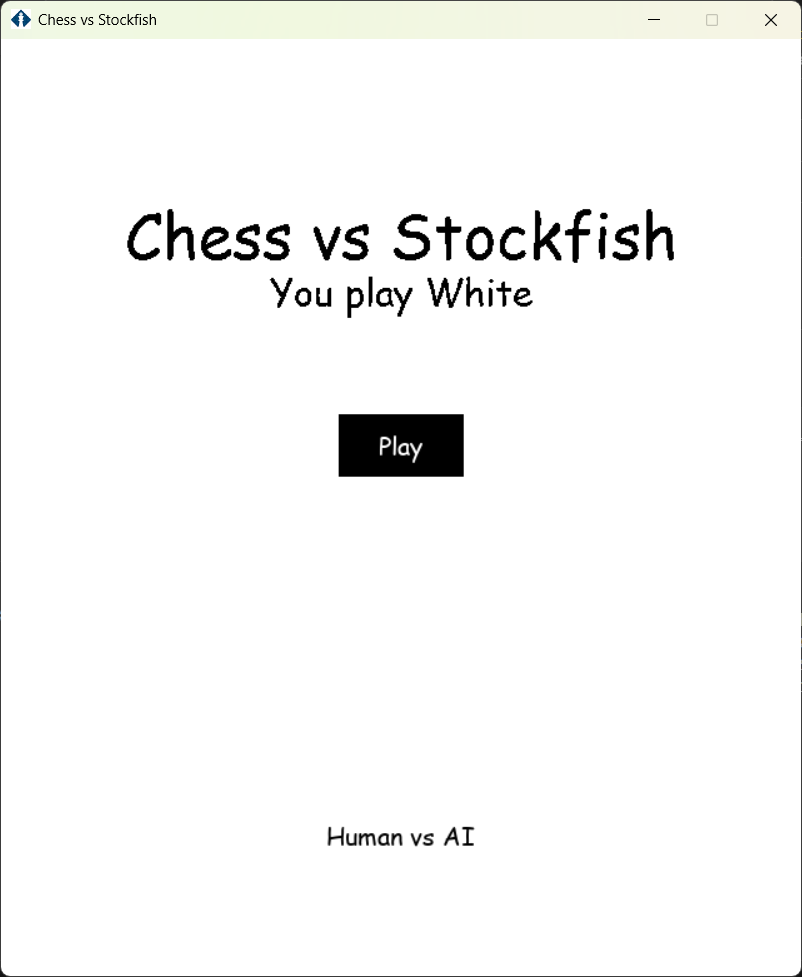
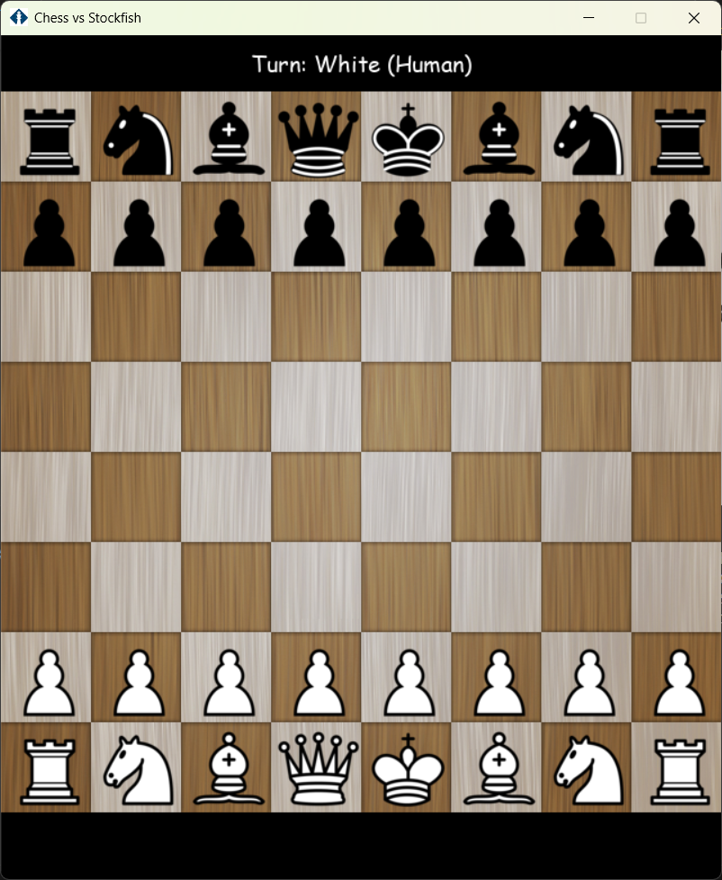
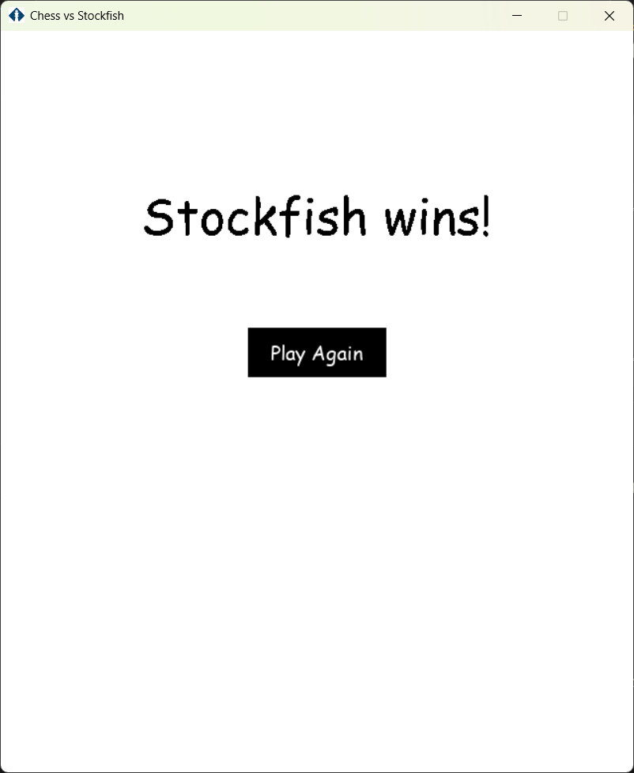

# ♟️ Chess vs Stockfish

<div align="center">


**Un jeu d'échecs avec interface graphique où vous affrontez l'IA Stockfish**

[Fonctionnalités](#-fonctionnalités) • [Installation](#-installation) • [Utilisation](#-utilisation) • [Architecture](#-architecture-technique) • [Contribuer](#-contribution)

---

</div>

## 📖 Description

**Chess vs Stockfish** est un jeu d'échecs complet développé en Python avec Pygame, intégrant le moteur d'échecs **Stockfish** comme adversaire. Le projet combine une interface graphique intuitive avec une validation stricte des règles officielles des échecs grâce à la bibliothèque `python-chess`.

### ✨ Points forts

- 🎮 **Interface graphique moderne** avec Pygame
- 🤖 **IA puissante** via Stockfish (moteur champion du monde)
- ✅ **Validation stricte** de tous les coups avec python-chess
- 🏆 **Règles complètes** : échec, mat, pat, répétition, etc.
- 🔄 **Système de récupération** : continue même si Stockfish plante
- 🎯 **Mode dégradé** : IA aléatoire de secours après échecs multiples

---

## 🎯 Fonctionnalités

### Gameplay

| Fonctionnalité | Description |
|---------------|-------------|
| ♟️ **Jeu complet** | Toutes les pièces et règles des échecs |
| 🎨 **Interface intuitive** | Cliquez pour sélectionner et déplacer |
| 👤 **Joueur vs IA** | Vous jouez les blancs, Stockfish les noirs |
| ⚡ **Coups légaux uniquement** | Validation stricte en temps réel |
| 🔴 **Indication d'échec** | Affichage visuel quand le roi est en échec |

### Détection de fin de partie

| Type | Détection | Affichage |
|------|-----------|-----------|
| ♔ **Échec et mat** | ✅ Automatique | "You Win! (Checkmate)" / "Stockfish Wins! (Checkmate)" |
| 🤝 **Pat** | ✅ Automatique | "Draw! (Stalemate)" |
| ♾️ **Matériel insuffisant** | ✅ Automatique | "Draw! (Insufficient Material)" |
| 🔁 **Répétition 3x** | ✅ Automatique | "Draw! (Threefold Repetition)" |
| 5️⃣0️⃣ **Règle 50 coups** | ✅ Automatique | "Draw! (Fifty-move Rule)" |

### Robustesse

- 🛡️ **Validation des coups** : Stockfish ne peut pas jouer de coups illégaux
- 🔄 **Récupération automatique** : Le jeu continue même si Stockfish plante
- 🎲 **Mode IA aléatoire** : Bascule automatique après 3 échecs consécutifs
- ⏱️ **Timeout de 5 secondes** : Évite les blocages infinis

---

## 🚀 Installation

### Prérequis

- **Python 3.12** ou supérieur
- **Windows** (testé sur Windows 10/11)

### Étapes d'installation

1. **Cloner le projet**
   ```bash
   git clone https://github.com/romainbouchez/chess-vs-stockfish.git
   cd chess-vs-stockfish
   ```

2. **Installer les dépendances**
   ```bash
   pip install -r requirements.txt
   ```

   Ou manuellement :
   ```bash
   pip install pygame python-chess
   ```

3. **Télécharger un moteur d'échecs**

   Le jeu téléchargera automatiquement Stockfish au premier lancement via le menu Paramètres > Moteurs.

   Vous pouvez aussi télécharger manuellement Stockfish depuis [stockfishchess.org](https://stockfishchess.org/download/) et le placer dans le dossier `engines/`

4. **Structure des fichiers**
   ```
   chess-vs-stockfish/
   ├── main_stockfish.py              # Point d'entrée
   ├── game_with_stockfish.py         # Logique du jeu
   ├── chess_with_validation.py       # Moteur d'échecs avec validation
   ├── uci_stockfish_robust.py        # Interface Stockfish
   ├── piece.py                       # Gestion des sprites
   ├── utils.py                       # Utilitaires
   ├── bestmove.txt                   # Fichier temporaire (auto-créé)
   └── res/                           # Ressources (optionnel)
       ├── board.png                  # Image du plateau
       ├── pieces.png                 # Sprites des pièces
       └── chess_icon.png             # Icône de la fenêtre
   ```

---

## 🎮 Utilisation

### Lancer le jeu

```bash
python main_stockfish.py
```

### Contrôles

| Action | Contrôle |
|--------|----------|
| **Sélectionner une pièce** | Clic gauche |
| **Déplacer une pièce** | Clic sur la destination |
| **Nouvelle partie** | Espace |
| **Quitter** | Échap |

### Déroulement d'une partie

1. **Menu principal** : Cliquez sur "Play" pour commencer
2. **Votre tour** : Vous jouez les blancs (pièces en bas)
   - Cliquez sur une pièce blanche pour la sélectionner
   - Les cases valides s'illuminent en bleu
   - Cliquez sur une case valide pour jouer
3. **Tour de Stockfish** : L'IA joue automatiquement les noirs
4. **Fin de partie** : Affichage du résultat (mat, pat, etc.)
5. **Rejouer** : Cliquez sur "Play Again" ou appuyez sur Entrée

---

## 🏗️ Architecture technique

### Diagramme de flux

```
┌─────────────────┐
│   main.py       │  Point d'entrée
└────────┬────────┘
         │
         ▼
┌─────────────────┐
│   Game          │  Boucle principale, interface Pygame
└────────┬────────┘
         │
         ▼
┌─────────────────┐
│   Chess         │  Logique du jeu + validation
└────┬─────┬──────┘
     │     │
     │     └──────────────────┐
     │                        │
     ▼                        ▼
┌─────────────┐    ┌──────────────────┐
│ python-chess│    │  uci_stockfish   │  Interface Stockfish
│ (validation)│    │  (subprocess)    │
└─────────────┘    └──────────────────┘
                            │
                            ▼
                   ┌──────────────┐
                   │  Stockfish   │  Moteur d'échecs
                   │  Engine      │
                   └──────────────┘
```

### Composants principaux

#### 1. **Validation des coups** (`chess_with_validation.py`)

```python
# Board de validation synchronisé avec la position
self.validation_board = chess.Board()

# Validation automatique de tous les coups
def validate_and_apply_move(self, move_uci):
    move = chess.Move.from_uci(move_uci)
    if move in self.validation_board.legal_moves:
        self.validation_board.push(move)
        return True
    return False
```

#### 2. **Intégration Stockfish** (`uci_stockfish_robust.py`)

- **Communication** : Via subprocess et fichier temporaire
- **Configuration** : 1 thread, 64 MB hash, 0.5s par coup
- **Sécurité** : Timeout, validation FEN, gestion d'erreurs

#### 3. **Interface graphique** (`game_with_stockfish.py`)

- **Rendu** : Pygame pour l'affichage
- **Événements** : Gestion souris et clavier
- **Menus** : Démarrage, jeu, fin de partie

### Formats de données

#### Notation UCI (Universal Chess Interface)
```
e2e4  → Pion de e2 vers e4
g1f3  → Cavalier de g1 vers f3
e7e8q → Promotion en dame
```

#### FEN (Forsyth-Edwards Notation)
```
rnbqkbnr/pppppppp/8/8/8/8/PPPPPPPP/RNBQKBNR w KQkq - 0 1
│         │         │ │ │  │ │ │ │ │  │ │  └─ Numéro de coup
│         │         │ │ │  │ │ │ │ │  │ └──── Demi-coups depuis dernière capture
│         │         │ │ │  │ │ │ │ │  └────── Case en passant possible
│         │         │ │ │  │ │ │ │ └───────── Possibilité de roque
│         │         │ │ │  │ │ │ └─────────── Tour au trait (w=blanc, b=noir)
│         │         │ │ │  │ │ └───────────── Rangée 2
│         │         │ │ │  │ └─────────────── Rangée 1 (blancs)
│         │         │ │ │  └───────────────── ...
│         │         │ │ └──────────────────── Rangée 7 (noirs)
│         │         │ └────────────────────── Rangée 8
```

---

## ⚙️ Configuration

### Ajuster la difficulté de Stockfish

Éditez `uci_stockfish_robust.py` :

```python
# Temps de réflexion (en secondes)
SEARCH_TIME = 0.5  # Plus élevé = plus difficile

# Configuration du moteur
engine.configure({
    "Threads": 1,          # Nombre de threads CPU
    "Hash": 64,            # Mémoire en MB
    "Skill Level": 15      # Niveau (1-20, 20=max)
})
```

### Personnaliser l'interface

Dans `game_with_stockfish.py` :

```python
# Dimensions de la fenêtre
screen_width = 640
screen_height = 750

# Couleurs du plateau (si pas d'image)
LIGHT_SQUARE = (240, 217, 181)
DARK_SQUARE = (181, 136, 99)
```

---

## 🐛 Dépannage

### Problème : Stockfish ne répond pas

**Solution :**
1. Vérifiez le chemin dans `uci_stockfish_robust.py` :
   ```python
   ENGINE_PATH = r"C:\votre\chemin\stockfish.exe"
   ```
2. Testez Stockfish manuellement :
   ```bash
   python uci_stockfish_robust.py "rnbqkbnr/pppppppp/8/8/8/8/PPPPPPPP/RNBQKBNR w KQkq - 0 1"
   ```
3. Vérifiez que `bestmove.txt` se crée

### Problème : Erreur "ModuleNotFoundError: No module named 'chess'"

**Solution :**
```bash
pip install python-chess
```

### Problème : Conflit de noms "chess.py"

**Solution :**
Ne nommez **jamais** un fichier `chess.py` dans votre projet. Utilisez `chess_game.py` ou `chess_with_validation.py`.

### Problème : Stockfish plante avec "ACCESS_VIOLATION"

**Solution :**
Réduisez les ressources dans `uci_stockfish_robust.py` :
```python
SEARCH_TIME = 0.1  # Très rapide
engine.configure({
    "Threads": 1,
    "Hash": 16     # Mémoire minimale
})
```

### Problème : Coups rejetés comme illégaux

**Cause :** Désynchronisation entre board de validation et interface.

**Solution :** Le système se synchronise automatiquement. Si le problème persiste :
- Redémarrez la partie (Espace)
- Vérifiez les logs pour identifier le coup problématique

---

## 📊 Comparaison des versions

| Fonctionnalité | Version originale | Version actuelle |
|---------------|-------------------|------------------|
| Interface graphique | ✅ Pygame | ✅ Pygame amélioré |
| Validation des coups | ❌ Basique | ✅ python-chess |
| IA intégrée | ❌ Non | ✅ Stockfish |
| Échec et mat | ❌ Capture du roi | ✅ Détection officielle |
| Pat | ❌ Non détecté | ✅ Match nul |
| Indication d'échec | ❌ Non | ✅ Affichage visuel |
| Gestion d'erreurs | ❌ Crashes | ✅ Récupération auto |
| Mode dégradé | ❌ Non | ✅ IA aléatoire |
| Règles complètes | ❌ Partielles | ✅ 100% FIFA |

---

## 🎨 Captures d'écran

### Menu principal



### Partie en cours



### Fin de partie


---
## 📜 Licence

Ce projet est sous licence MIT. Voir le fichier `LICENSE` pour plus de détails.

---

## 🙏 Crédits

### Projet développé par
- **Romain BOUCHEZ** - Développement et intégration

### Technologies utilisées
- [Python](https://www.python.org/) - Langage de programmation
- [Pygame](https://www.pygame.org/) - Bibliothèque graphique
- [python-chess](https://python-chess.readthedocs.io/) - Validation des règles
- [Stockfish](https://stockfishchess.org/) - Moteur d'échecs

### Inspirations
- Projet original [pygame-chess](https://github.com/mandrelbrotset/pygame-chess) par mandrelbrotset
- Communauté Stockfish pour le moteur d'échecs

---

## 📞 Contact

Pour toute question ou suggestion :

- 📧 Email : bouchez@et.esiea.fr
- 🐛 Issues : [GitHub Issues](https://github.com/romainbouchez/chess-vs-stockfish/issues)
- 💬 Discussions : [GitHub Discussions](https://github.com/votre-username/chess-vs-stockfish/discussions)

---

<div align="center">

**Fait avec ❤️ et ♟️**

⭐ Si vous aimez ce projet, n'hésitez pas à lui donner une étoile !

[⬆ Retour en haut](#️-chess-vs-stockfish)

</div>