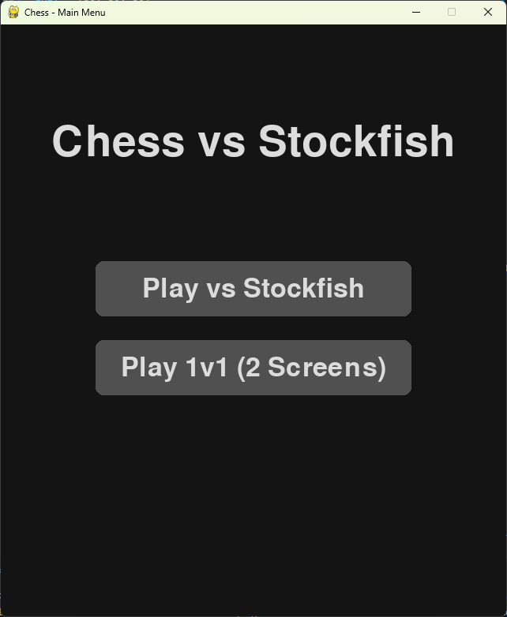
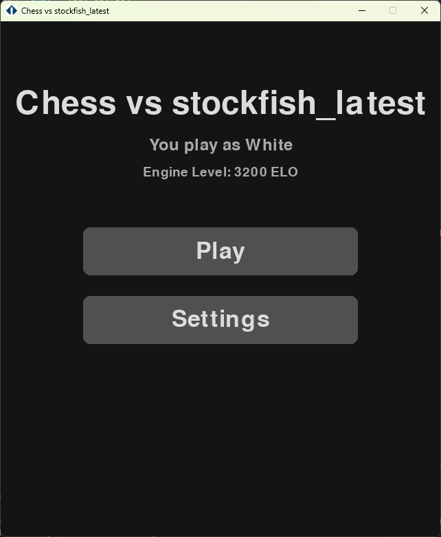
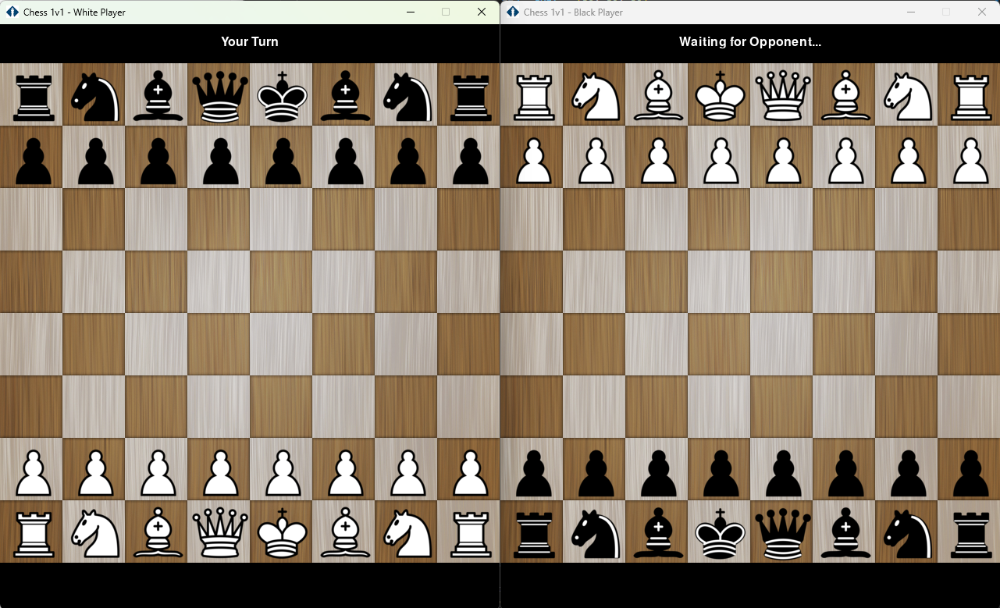

# Chess vs Stockfish

<div align="center">


**Jeu d'echecs avec moteur Stockfish configurable, disponible en interface Web (Next.js) et Desktop (Pygame), avec integration robot physique.**

</div>

---

## Table des Matieres

1. [A Propos du Projet](#a-propos-du-projet)
2. [Web App (Next.js + FastAPI)](#-web-app-nextjs--fastapi)
3. [Page Admin](#-page-admin)
4. [Application Desktop (Pygame)](#-application-desktop-pygame)
5. [Integration Robot](#-integration-robot)
6. [Structure du Projet](#-structure-du-projet)
7. [Contribuer](#-contribuer)
8. [Contact](#-contact)

---

## A Propos du Projet

**Chess vs Stockfish** est une implementation complete du jeu d'echecs en Python. Le projet propose deux interfaces distinctes :

- **Web App** : Interface moderne Next.js + FastAPI avec communication temps reel, support mobile, mode PvP en reseau local, et integration robot.
- **Application Desktop** : Interface Pygame avec mode 1v1 sur deux ecrans synchronises.

Les deux interfaces partagent le meme moteur Stockfish et le meme controleur robot.

---

# Web App (Next.js + FastAPI)

### Screenshots

<!-- TODO: Ajouter les screenshots de la web app -->
*Screenshots a venir*

---

### Architecture

L'application web utilise une architecture 3 couches : un **frontend Next.js** communique en temps reel avec un **backend Python FastAPI**, qui orchestre la logique de jeu, Stockfish, et le **robot physique** via port serie.

```
┌─────────────────────────────────────────────────────────┐
│              NAVIGATEUR (Mobile / Desktop)               │
│  ┌───────────────────────────────────────────────────┐  │
│  │  Frontend Next.js (localhost:3000)                 │  │
│  │  - Echiquier interactif (react-chessboard)        │  │
│  │  - Bouton connexion robot                         │  │
│  │  - Affichage pieces capturees et statut           │  │
│  └──────────────┬──────────────────┬─────────────────┘  │
│        WebSocket (Socket.IO)    HTTP REST                │
│        make_move, join_pve      /api/robot/connect       │
│        game_state               /api/robot/disconnect    │
└─────────────────┬──────────────────┬────────────────────┘
                  │    Port 8000     │
                  ▼                  ▼
┌─────────────────────────────────────────────────────────┐
│              BACKEND (Python FastAPI + Socket.IO)         │
│  ┌───────────────────────────────────────────────────┐  │
│  │  server.py - Serveur WebSocket + REST             │  │
│  │  game_manager.py - Logique d'echecs               │  │
│  │  session_manager.py - Sessions PvP                │  │
│  └──────────┬──────────────────────┬─────────────────┘  │
│    python-chess (validation)    Stockfish (UCI)           │
│             │                                            │
│             ▼                                            │
│  ┌───────────────────────────────────────────────────┐  │
│  │  robot.execute_move(uci_move, is_capture)         │  │
│  └──────────────────────┬────────────────────────────┘  │
└─────────────────────────┬───────────────────────────────┘
                          │ Import direct (sys.path)
                          ▼
┌─────────────────────────────────────────────────────────┐
│         ROBOT CONTROLLER (G-Code_Controller/)            │
│  ┌───────────────────────────────────────────────────┐  │
│  │  robot_chess_controller.py (ChessRobotController) │  │
│  │  - Conversion UCI → coordonnees XY (mm)           │  │
│  │  - Generation de commandes G-Code                 │  │
│  │  - Gestion captures et coups speciaux             │  │
│  └──────────────────────┬────────────────────────────┘  │
└─────────────────────────┬───────────────────────────────┘
                          │ Serie (pySerial)
                          │ COM5 @ 250000 baud
                          ▼
┌─────────────────────────────────────────────────────────┐
│              ROBOT PHYSIQUE                               │
│  - Controleur CNC (firmware GRBL)                        │
│  - Moteurs pas-a-pas (axes X, Y, Z)                     │
│  - Electro-aimant (prehenseur)                           │
│  - Servo pronation (rotation piece)                      │
└─────────────────────────────────────────────────────────┘
```

---

### Comment ca fonctionne

#### Communication Frontend <-> Backend

- **WebSocket (Socket.IO)** : Communication temps reel pour les coups (`make_move`), les mises a jour d'etat (`game_state`), et les sessions PvP (`join_pvp`, `player_ready`).
- **REST API (HTTP)** : Commandes ponctuelles comme la connexion robot (`POST /api/robot/connect`), la reinitialisation (`POST /api/game/reset`), et les reglages Stockfish (`GET/POST /api/settings`).

#### Communication Backend <-> Robot

- **Import Python direct** : Le `GameManager` importe `ChessRobotController` depuis `G-Code_Controller/` et appelle `robot.execute_move()` a chaque coup joue.
- **Port serie (G-Code)** : Le controleur convertit les coups UCI en commandes G-Code envoyees au robot via `pySerial` (RS-232/USB).

#### Sequence d'execution d'un coup (exemple : `e2e4`)

1. **Frontend** : L'utilisateur deplace une piece → `socket.emit("make_move", { uci: "e2e4" })`
2. **Backend** : `server.py` recoit l'evenement WebSocket → appelle `game.apply_move("e2e4")`
3. **GameManager** : Valide le coup avec `python-chess`, detecte si c'est une capture
4. **Robot** (si connecte) : `robot.execute_move("e2e4", is_capture)` est appele
5. **Controleur Robot** : Convertit `e2` → coordonnees XY (mm), genere la sequence G-Code :
   ```gcode
   G0 X156.93 Y257.15 Z50   ; Se positionner au-dessus de la case source
   G0 Z5                     ; Descendre vers la piece
   M3 S1000                  ; Activer l'electro-aimant (saisir)
   G0 Z30                    ; Monter avec la piece
   G0 X274.79 Y257.15       ; Se deplacer vers la case destination
   G0 Z5                     ; Descendre
   M5                        ; Desactiver l'electro-aimant (relacher)
   G0 Z50                    ; Remonter en position sure
   ```
6. **Port serie** : Les commandes sont envoyees ligne par ligne au controleur GRBL, qui attend un `ok` apres chaque commande
7. **Backend** : Emet `game_state` au frontend avec le nouvel etat de la partie
8. **Frontend** : Met a jour l'echiquier et affiche les pieces capturees

#### Modes de jeu

- **PvE (Player vs Stockfish)** : Le joueur affronte Stockfish. Le niveau ELO est configurable. Le robot reproduit les coups des deux cotes.
- **PvP (Player vs Player)** : Deux joueurs sur le meme reseau local. Chaque joueur accede a sa page selon sa couleur :
  - Blancs : `localhost:3000/play?color=white`
  - Noirs : `localhost:3000/play?color=black`

---

# Page Admin

La page admin (`/admin`) permet de superviser et gerer les sessions en temps reel depuis n'importe quel appareil du reseau local.

### Acces

```
http://localhost:3000/admin
http://<ip-du-serveur>:3000/admin
```

Un **mot de passe** est requis a la premiere visite. La session est conservee pour l'onglet en cours (sessionStorage).

### Fonctionnalites

| Section | Description |
|---|---|
| **Stats globales** | Nombre de joueurs en partie, en file d'attente, sessions PvE actives |
| **Partie en cours** | Etat des sieges Blanc et Noir : identifiant, statut de connexion, temps en jeu, pret ou non |
| **File d'attente** | Liste de tous les joueurs en attente avec position, couleur demandee, temps d'attente |
| **Reordonnancement** | Boutons ▲ / ▼ pour changer la position d'un joueur dans la file |
| **Deconnexion** | Bouton "Kick" pour expulser n'importe quel joueur (file ou partie) |

Le tableau de bord se **rafraichit automatiquement toutes les 2 secondes**.

### Comportement lors d'un kick

- Le joueur expulse voit un ecran "Deconnecte par l'administrateur" avec un bouton pour rejoindre la file.
- La file d'attente est automatiquement mise a jour et les positions recalculees.
- Si le siege libere peut etre rempli par un joueur en file, il est promu immediatement.

### API Admin (backend)

| Methode | Endpoint | Description |
|---|---|---|
| `GET` | `/api/admin/state` | Retourne l'etat complet (joueurs, file, PvE) |
| `POST` | `/api/admin/kick` | Expulse un joueur par son `sid` |
| `POST` | `/api/admin/reorder` | Deplace un joueur dans la file (`direction: "up"\|"down"`) |

---

### Lancement

#### Prerequis

- **Python 3.12+**
- **Node.js 18+**
- **npm**

#### Installation

```sh
# Cloner le depot
git clone https://github.com/romainbouchez/chess-vs-stockfish.git
cd chess-vs-stockfish

# Installer les dependances Python
pip install -r requirements.txt

# Installer les dependances Frontend
cd frontend
npm install
cd ..
```

#### Demarrage rapide (Windows)

```sh
start_app.bat
```

Ce script lance automatiquement le backend et le frontend.

#### Demarrage manuel

```sh
# Terminal 1 : Backend (port 8000)
python -m uvicorn backend.server:socket_app --host 0.0.0.0 --port 8000 --reload

# Terminal 2 : Frontend (port 3000)
cd frontend
npm run dev
```

Ouvrez http://localhost:3000 dans votre navigateur.

---

---

# Application Desktop (Pygame)

### Screenshots

| Menu principal | Partie vs Stockfish | Mode 1v1 |
|:-:|:-:|:-:|
|  |  |  |

---

### Architecture

L'application desktop est structuree autour d'un lanceur central qui dirige vers les differents modes de jeu.

```
                      +-----------------------+
                      |   main_stockfish.py   |
                      | (Point d'entree)      |
                      +-----------+-----------+
                                  |
                   +--------------+--------------+
                   |                             |
         CHOIX DE MODE: PVE             CHOIX DE MODE: PVP
                   |                             |
                   |                +----------------------------+
                   |                | Lance 2 processus de       |
                   |                | game_with_stockfish.py     |
                   |                +-------------+--------------+
                   |                              |
                   | (Instance unique)            | (Client Blanc & Client Noir)
                   |                              |
                   +--------------+---------------+
                                  |
                      +-----------v-----------+
                      | game_with_stockfish.py|
                      | (Boucle de jeu, UI)   |
                      +-----------+-----------+
                                  |
                      +-----------v-----------+
                      | chess_with_validation.py|
                      | (Logique, validation) |
                      +-----------+-----------+
                                  |
           +----------------------+----------------------+
           |                      |                      |
+----------v---------+ +----------v----------+ +---------v----------+
|   python-chess     | |    next_move.txt    | |   uci_stockfish.py |
|    (Validation)    | |    (Synchro 1v1)    | | (Communication IA) |
+--------------------+ +---------------------+ +----------+---------+
                                                         |
                                             +-----------v----------+
                                             |   Stockfish Engine   |
                                             |     (executable)     |
                                             +----------------------+
```

---

### Comment ca fonctionne

#### Communication

- **Mode IA (PVE)** : La communication avec le moteur Stockfish se fait via des `subprocess` qui executent le moteur en arriere-plan. Le joueur affronte une IA dont le niveau est configurable (ELO 1350 a 3200).
- **Mode 1v1 (PVP)** : La synchronisation entre les deux fenetres de jeu est assuree par un fichier (`next_move.txt`) agissant comme un canal de communication inter-processus (IPC). Le plateau du joueur Noir est automatiquement retourne.

#### Flux de donnees PVE

```
User Input → game_with_stockfish.py → chess_with_validation.py
    ↓
python-chess (validation)
    ↓
uci_stockfish.py → Stockfish Engine → Best Move
    ↓
chess_with_validation.py (applique le coup) → game_with_stockfish.py (affichage)
```

#### Flux de donnees PVP

```
Instance 1 (Blanc)                    Instance 2 (Noir)
      ↓                                      ↓
User Input → coup valide             Lit next_move.txt
      ↓                                      ↓
Ecrit dans next_move.txt             Applique le coup
      ↓                                      ↓
Lit next_move.txt                    User Input → coup valide
      ↓                                      ↓
Applique le coup                     Ecrit dans next_move.txt
```

#### Configuration de l'IA

La difficulte est ajustable depuis l'interface via le bouton **Settings** :

- **Niveau ELO** : 1350 (Debutant) a 3200 (Grand Maitre)
- **Threads** : Nombre de coeurs CPU utilises
- **Hash Memory** : Memoire RAM allouee au moteur
- **Time Limit** : Temps de reflexion par coup
- **Depth Limit** : Profondeur de recherche

Le menu **Engines** permet de telecharger et gerer differentes versions de Stockfish.

---

### Lancement

#### Prerequis

- **Python 3.12+**

#### Installation

```sh
# Cloner le depot
git clone https://github.com/romainbouchez/chess-vs-stockfish.git
cd chess-vs-stockfish

# Installer les dependances
pip install -r requirements.txt
```

#### Demarrage

```sh
python main_stockfish.py
```

Au premier lancement, telecharger Stockfish via le menu **Engines** :

1. Cliquez sur **"Play vs Stockfish"**
2. Cliquez sur **"Engines"**
3. Selectionnez **"Stockfish latest"** → **"Download"**
4. Cliquez sur **"Play"**

**Raccourcis clavier :**
- `ESC` : Quitter le jeu
- `ESPACE` : Reinitialiser la partie

---

---

# Integration Robot

Le dossier `G-Code_Controller/` contient un systeme complet pour controler un robot echiquier physique. Le robot est compatible avec les deux interfaces (Web App et Pygame).

### Fonctionnalites

- Communication serie avec controleur G-Code (Marlin/GRBL)
- Detection et gestion automatique des captures (zones de stockage)
- Gestion des coups speciaux (roque, prise en passant, promotion)
- Electro-aimant pour saisir/relacher les pieces (commandes M3/M5)
- Servo pronation pour la rotation des pieces
- Calibration du plateau et des pieces

### Prerequis

- Robot branche en USB (port **COM6**, baudrate **250000**)
- Robot alimente (LED allumee)
- Aucun autre logiciel n'utilise COM6 (Arduino IDE Serial Monitor, Putty, etc.)

```sh
pip install pyserial
```

### Connexion via la Web App

1. Lancez le backend et le frontend
2. Ouvrez `http://localhost:3000` dans votre navigateur
3. Cliquez sur le bouton **"Connect Robot"** dans la barre d'outils
4. Le backend ouvre le port serie, initialise le firmware et effectue le homing
5. Chaque coup joue sur l'echiquier web est automatiquement reproduit par le robot

> **Note :** La connexion robot est disponible uniquement en mode PvE (Player vs Stockfish).

### Connexion via PowerShell (test direct)

```powershell
Invoke-WebRequest -Method POST -Uri "http://localhost:8001/api/robot/connect" -UseBasicParsing
```

Reponse attendue :
```json
{"status": "success", "message": "Robot connecte"}
```

### Architecture technique

```
Frontend (Next.js :3000)
    │
    │  POST /api/robot/connect
    ▼
Backend FastAPI (uvicorn :8001)
  └─ server.py :: connect_robot()
       │
       ▼
  game_manager.py :: GameManager(enable_robot=True)
       │  instancie
       ▼
  robot_chess_controller.py :: ChessRobotController
       │  lit la config
       ▼
  robot_config.ini  (port, baudrate, dimensions plateau...)
       │
       │  serial.Serial(port="COM6", baudrate=250000)
       ▼
  Firmware Marlin (Arduino) via USB
```

### Sequence de connexion detaillee

1. `server.py` recoit le POST et instancie `GameManager(enable_robot=True)`
2. `GameManager` cree un `ChessRobotController()` qui lit `robot_config.ini`
3. `ChessRobotController.connect()` ouvre le port serie COM6 a 250000 bauds
4. Attente de **2 secondes** (`connection_delay`) pour laisser l'Arduino rebooter
5. Lecture du message de demarrage firmware (`start`)
6. Envoi des commandes d'initialisation G-code :
   ```
   G21    → unites en millimetres
   G90    → coordonnees absolues
   G94    → avance en mm/min
   F10000 → vitesse de deplacement par defaut
   ```
7. `home_robot()` deplace le bras en position de depart (coin a1)

### Protocole serie

- Chaque commande G-code est envoyee en ASCII terminee par `\n`
- Le firmware repond `ok` pour confirmer l'execution
- Timeout de lecture : **2 secondes** par tentative, max **10 tentatives**

### Conversion coup d'echecs → G-code

Un coup UCI (ex: `e2e4`) est converti en coordonnees physiques via :
```python
x = board_offset_x + (col * square_size)    # col = 0..7
y = board_offset_y + (row * square_size)    # row = 0..7
```
Avec `square_size = 58.93 mm` et `offset = (100.0, 100.0)`.

Sequence pour deplacer une piece :
```
G0 Z50               → monter (position safe)
G0 X<src_x> Y<src_y> → aller au-dessus de la case source
G0 Z5                → descendre (z_grab)
M3 S1000             → activer l'electroaimant (grab)
G0 Z30               → lever la piece (z_lift)
G0 X<dst_x> Y<dst_y> → deplacer vers la case cible
G0 Z5                → descendre
M5                   → desactiver l'electroaimant (release)
G0 Z50               → remonter en position safe
```

### Configuration (`robot_config.ini`)

| Section | Parametre | Valeur par defaut | Description |
|---|---|---|---|
| `[SERIAL]` | `port` | `COM6` | Port USB de l'Arduino |
| `[SERIAL]` | `baudrate` | `250000` | Vitesse serie (doit correspondre au firmware) |
| `[SERIAL]` | `timeout` | `2` | Timeout lecture en secondes |
| `[BOARD]` | `square_size` | `58.93` | Taille d'une case en mm |
| `[BOARD]` | `board_offset_x/y` | `100.0` | Decalage origine plateau en mm |
| `[HEIGHTS]` | `z_safe` | `50.0` | Hauteur de deplacement libre (mm) |
| `[HEIGHTS]` | `z_grab` | `5.0` | Hauteur de saisie de piece (mm) |
| `[HEIGHTS]` | `z_lift` | `30.0` | Hauteur de transport de piece (mm) |
| `[GRIPPER]` | `grab_command` | `M3 S1000` | Commande activation electroaimant |
| `[GRIPPER]` | `release_command` | `M5` | Commande desactivation electroaimant |
| `[ROBOT]` | `use_homing` | `false` | Effectuer un homing au demarrage |
| `[SPEEDS]` | `feed_rate_travel` | `10000` | Vitesse deplacement libre (mm/min) |
| `[SPEEDS]` | `feed_rate_work` | `1500` | Vitesse deplacement avec piece (mm/min) |
| `[ADVANCED]` | `connection_delay` | `2.0` | Attente apres ouverture port (s) |
| `[ADVANCED]` | `xy_settle_delay` | `1.0` | Attente stabilisation XY (s) |

### Mode debug sans robot

Dans `robot_config.ini`, activer :
```ini
[ADVANCED]
simulation_mode = true
```

Le backend utilise alors le `RobotDebugProxy` (`game_manager.py`) qui simule la connexion et logue toutes les commandes G-code sans rien envoyer sur le port serie.

### Erreurs courantes

**`PermissionError(13, 'Acces refuse.')`**
COM6 est deja ouvert par un autre programme.
```powershell
# Fermer Arduino IDE, Putty, etc., puis :
Get-Process -Name python | Stop-Process -Force
```

**`connect() a retourne False sur COM6`**
Le port s'est ouvert mais aucun `ok` recu apres initialisation.
- Verifier que le robot est alimente
- Verifier le bon port dans le Gestionnaire de peripheriques Windows
- Verifier que le baudrate du firmware correspond (250000)

**Pas de logs `[ROBOT-API]` dans la console**
Un vieux processus backend tourne encore sur le meme port.
```powershell
netstat -ano | findstr ":8001"
# Puis tuer tous les python.exe et relancer le backend
```

**Le robot repond mais ne se deplace pas correctement**
- Verifier `square_size` et `board_offset_x/y` dans `robot_config.ini`
- Activer `simulation_mode = true` pour tester sans mouvement physique

---

## Structure du Projet

```
chess-vs-stockfish/
│
├── frontend/                     # Web App (Next.js)
│   ├── app/page.tsx              # Page PvE (vs Stockfish)
│   ├── app/play/page.tsx         # Page PvP (1v1 en reseau)
│   ├── app/admin/page.tsx        # Page Admin (gestion file d'attente)
│   ├── components/               # Composants React
│   └── lib/socket.ts             # Client Socket.IO
│
├── backend/                      # Serveur API (FastAPI)
│   ├── server.py                 # WebSocket + REST endpoints
│   ├── game_manager.py           # Logique de jeu + orchestration robot
│   └── session_manager.py        # Gestion sessions PvP
│
├── G-Code_Controller/            # Controleur robot
│   ├── robot_chess_controller.py # Conversion UCI → G-Code
│   ├── chess_robot_integration.py# Integration legacy (Pygame)
│   ├── robot_calibration.py      # Calibration du plateau
│   └── robot_config.ini          # Configuration materielle
│
├── main_stockfish.py             # Point d'entree Pygame
├── game_with_stockfish.py        # Boucle de jeu Pygame
├── chess_with_validation.py      # Logique d'echecs (validation)
│
├── universal_engine.py           # Interface universelle moteurs
├── uci_stockfish.py              # Communication UCI Stockfish
├── engine_manager.py             # Telechargement/gestion moteurs
│
├── settings.py                   # Parametres Stockfish (ELO)
├── universal_settings.py         # Parametres universels
├── settings_menu.py              # Interface configuration Pygame
├── engine_menu.py                # Interface gestion moteurs Pygame
│
├── piece.py                      # Classe des pieces (sprites)
├── utils.py                      # Fonctions utilitaires
│
├── tests/                        # Tests
├── tools/                        # Outils de developpement
├── res/                          # Ressources graphiques
├── img/                          # Screenshots documentation
├── engines/                      # Moteurs d'echecs (telecharges)
│
├── start_app.bat                 # Script lancement Web App (Windows)
├── requirements.txt              # Dependances Python
└── README.md                     # Ce fichier
```

---

## Contribuer

Les contributions sont les bienvenues !

1. **Forkez le projet** sur GitHub
2. **Creez une nouvelle branche** (`git checkout -b feature/AmazingFeature`)
3. **Commitez vos changements** (`git commit -m 'Add some AmazingFeature'`)
4. **Pushez vers la branche** (`git push origin feature/AmazingFeature`)
5. **Ouvrez une Pull Request**

---

## Contact

**Romain BOUCHEZ** - bouchez@et.esiea.fr

Lien du projet : [https://github.com/romainbouchez/chess-vs-stockfish](https://github.com/romainbouchez/chess-vs-stockfish)
